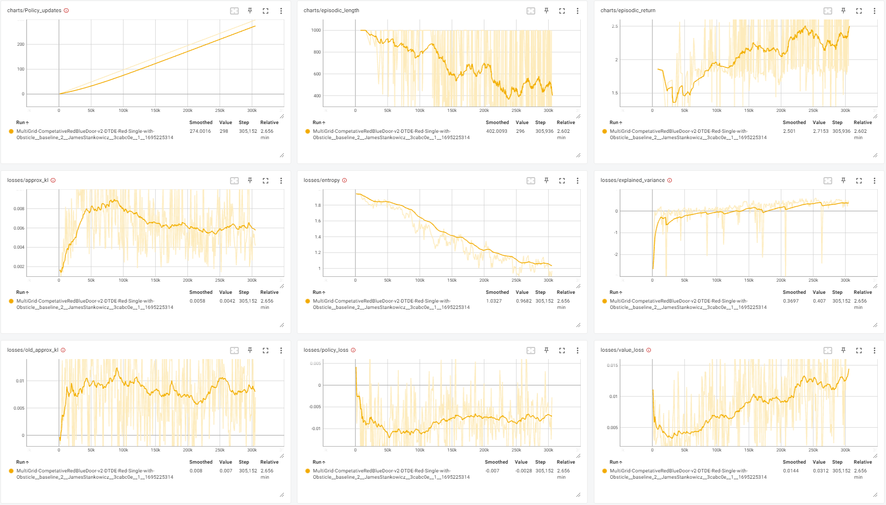

### Task 1 Questions
After running the above command, observe the outputs in the command line. This will provide essential information required to train your RL agent.

#### Questions for General Deep RL Training Parameters Understanding
**Q.1** From the command line outputs, can you report the values for the following parameters from the command line outputs? Additionally, please describe the role of each parameter in the training loop and explain how these values influence training in a sentence or two. This exercise can help you grasp the fundamentals of `Sample Efficiency` and understand the tradeoffs when scaling your training process in a parallel fashion.  

#### Answer:

- **num_envs**: 4
  - The number of different random seeds used to generate environments for training.
- **batch_size**: 512
  - Total number of time steps collected in a single rollout: `batch_size = num_steps * num_envs`.
- **num_minibatches**: 4
  - Number of minibatches. This divides the `batch_size` to give the minibatch size: `minibatch_size = batch_size / num_minibatches`.
- **minibatch_size**: 128
  - The number of time steps used to compute the policy loss. This is computed as `minibatch_size = batch_size / num_minibatches`.
- **total_timesteps**: 10,000,000
  - Total number of time steps to train the agent for. This is the number of environment steps sampled in total across all environments.
- **num_updates**: 19,531
  - Total number of training updates. This is computed as `num_updates = total_timesteps / batch_size = 10,000,000 // 512 = 19,531`. 
- **num_steps**: 128
  - The horizon (number of time steps) for each rollout.
- **update_epochs**: 4
  - Number of times to reuse each batch for training. 

## Task 2 - Understand the Deep RL Training Loop Dataflow & Implement Techniques to Minimize Learning Variance

In this task, you will delve into the specifics of the vectorized training architecture, which consists of two pivotal phases: the `Rollout Phase` and the `Learning Phase`. This is the parallelized training architecture that many Deep RL algorithms, including PPO used. You will also explore the techniques employed by PPO to reduce variance in learning, particularly focusing on the Generalized Advantage Estimation (GAE). You will enhance your understanding by identifying these phases in the code and implementing GAE to reduce variance of the training data before the `Learning Phase` when using the diversed data collected from the `Rollout Phase`.

### Questions to Enhance Understanding of the Deep RL Training Loop
***Q.1*** As mentioned in [The 37 Implementation Details of Proximal Policy Optimization](https://iclr-blog-track.github.io/2022/03/25/ppo-implementation-details/), PPO employs a streamlined paradigm known as the vectorized architecture. This architecture encompasses two phases within the training loop:

- **Rollout Phase**: During this phase, the agent samples actions for 'N' environments and continues to process them for a designated 'M' number of steps.

- **Learning Phase**: In this phase, fundamentally, the agent learns from the data collected during the rollout phase. This data, with a length of NM, includes 'next_obs' and 'done'.

Utilizing your baseline codebase tagged `v2.1`, please pinpoint the `Rollout Phase` and the `Learning Phase` within the codebase, indicating specific line numbers. 

* For instance, the lines [189-211 in CleanRL ppo.py](https://github.com/vwxyzjn/cleanrl/blob/master/cleanrl/ppo.py#L189-L211) represent the Rollout Phase in their PPO implementation.  

### Answer:
- **Rollout Phase**: [lines 500-528](multigrid/scripts/train_ppo_cleanrl.py)
- **Learning Phase**: [lines 620-707](multigrid/scripts/train_ppo_cleanrl.py)

## Task 3 - Tuning the 🎲 **Exploration & Exploitation Strategies** using Algorithm-Specific Hyperparameters

### Deepening Your Understanding to Interpret Your Results
***Q.1*** Train a baseline agent using default or adjusted parameter values. Capture and present Tensorboard screenshots to report the following training metrics. Indicate the `Sample Efficency`, the number of training timesteps and policy updates, required to achieve the Training Baseline Thresholds:

Only running ~300k steps does not hit the Baseline Thresholds.

**CleanRL Agent Training Baseline Thresholds for Your Reference**:
- `episodic_length` should converge to a solution within 40 time steps and maintain for at least 100k time steps at the end of training.
- `episodic_return` should converge to consistently achieve 2.0+ returns, enduring for a minimum of the last 100k time steps.
- `explained_variance` should stabilize at a level above 0.6 for at least the last 100k time steps.
- `entropy` should settle at values below 0.3 for a minimum of 100k final training steps.